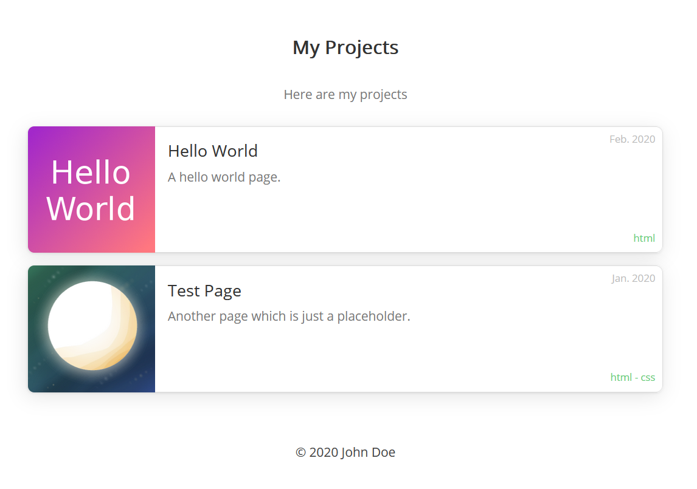

# Projects Browser


This small php library makes it easy to display projects on your web page.

## About
The library is written in an object oriented style and structured a bit like a content management system.
You can add projects directly in your script or specify a directory and the ProjectBrowser will look for all the subdirectories and list them as projects. This may not be the most efficient way but makes it very simple to use.

For each project you can provide `name`, `shortDescription`, `description`, `thumbnail`, `tags`, `date`

The library is therefore most suited, if you just have a bunch of projects and want to list them without a lot of effort.

## Requirements
`PHP 5` or newer is recommended.

## Installation
Just copy the folders `pb` and `example` in one folder of your php server.

You should then be able to open the example page `<url_to_the_folder_on_your_server>/example/index.php` in your browser.

## Add your own projects
In the [example/index.php](example/index.php) script you can see how to add your own projects and setup the additional information:
```php
<?php
include(dirname(__DIR__) . '/pb/ProjectBrowser.php');
include(dirname(__DIR__) . '/pb/renderers/SimpleCardListRenderer.php');

// create a new browser
$pb = new ProjectBrowser();
$pb->title = 'My Projects';
$pb->copyright = '&copy; 2020 John Doe';

// load the projects from the directory
$projectSection = $pb->loadProjectSection('projects');
if (!$projectSection) {
    print_r($pb->errorMessages);
    exit('Could not load project section');
}

// add some additional notes
$projectSection->name = 'My Projects';
$projectSection->description = 'Here are my projects';

// add the section to the project browser
$pb->addSection($projectSection);

// return the html to the client
echo $pb->getHtml(new SimpleCardListRenderer());
```

## Customize the page layout
To customize the page layout, you can extend the [HtmlRenderer](pb/HtmlRenderer.php) class. Or modify the [SimpleCardListRenderer](pb/renderers/SimpleCardListRenderer.php) which is used in the example.
